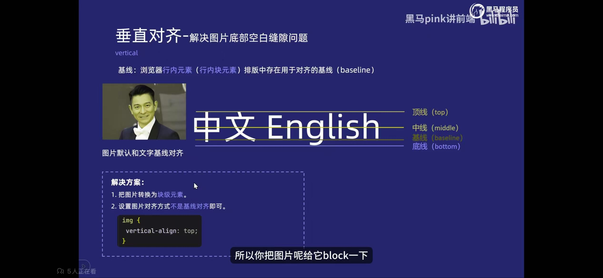
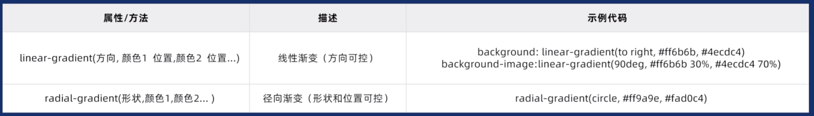
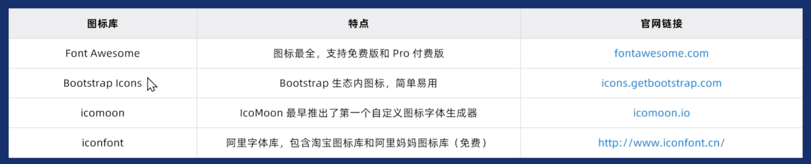
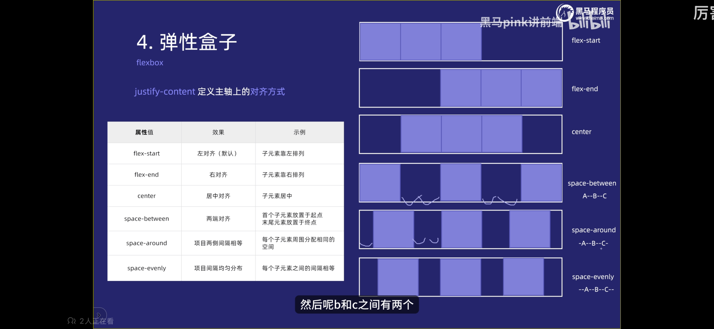
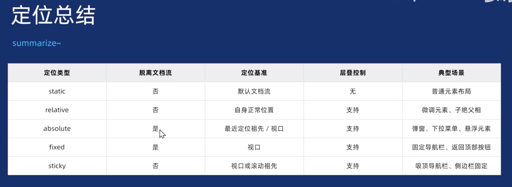
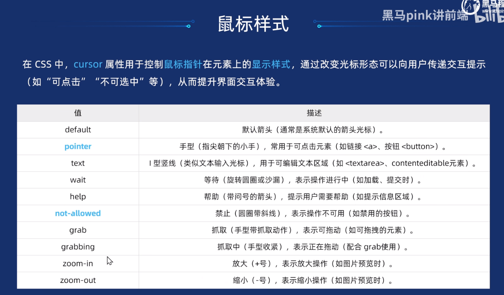
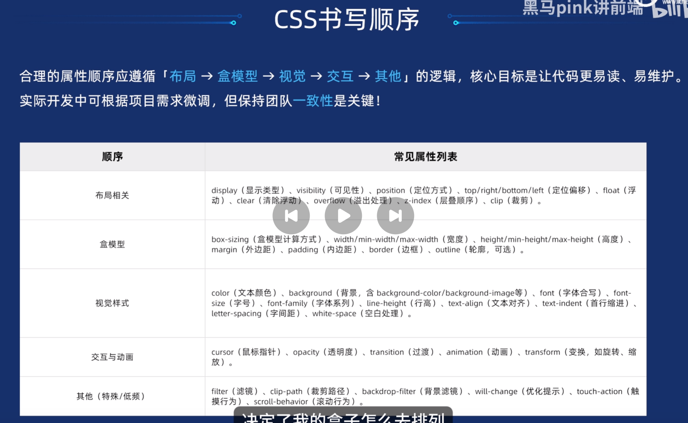
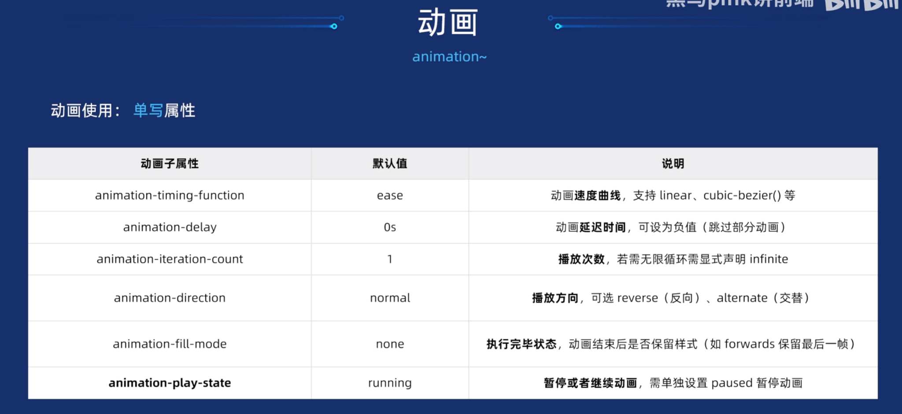
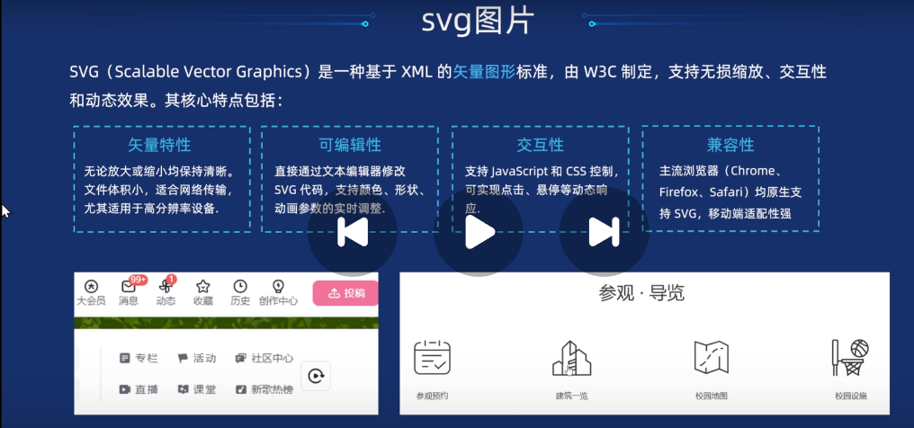
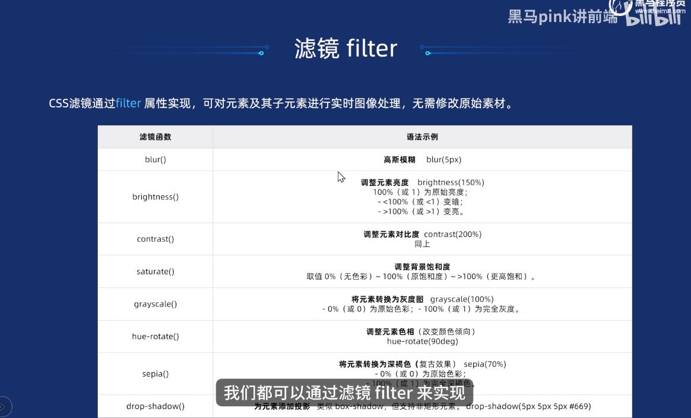

格式：
选择器    大括号{样式内容键值对}

写在<style></style>中

一些日常规范：
- 展开式写法，每行一个属性
- 用小写写css
- 冒号后带一个空格会更直观

基础选择器：
- 标签选择器：
标签名：div p table

- 类选择器
.class   命名基本使用英文小写加短横线

- id选择器
\#xxx
ID选择器配合Js写互动，用类选择器来做样式

- 通配符选择器
** 使用星号选择所有的标签

复合选择器
- 后代选择器 
	- 选择器 空格 选择器 最终选择的后面的，后面的元素可以是儿子也可以是孙子，只要是后代即可，可以使用任意的选择器，不需要都是标签选择器
- 子选择器
	- 选择器 > 选择器  只能选择最近一级

```css
/* 邻接选择器：仅选择紧接在 h2 元素后的第一个 p 元素 */
h2+p {
      color: red;
    }
/* 通用兄弟选择器：选择 h2 元素后面的所有 p 元素 */
h2~p {
  color: blue;
} 
```

- 并集选择器
	- 选择器 ，选择器  
	
- 伪类选择器  类选择器用一个点，伪类选择器用两个点，就是冒号：
	- 链接伪类选择器   
		- a ：link  未访问过的链接
		- a ：visited 已访问过的链接
		- a ：hover 鼠标经过
		- a ：active 鼠标按下不松
		- 为确保生效顺序是LVHA
		- 链接具有默认样式，如果要设置需要单独指定，不能给外层指定
		- ：focus 获取焦点

	- 结构伪类选择器

| 伪类                 | 含义                   | 典型用法示例                |
| ------------------ | -------------------- | --------------------- |
| `:first-child`     | 作为父元素的**第一个**子元素     | 列表第一个不加下边框            |
| `:last-child`      | 作为父元素的**最后一个**子元素    | 表格最后一行特殊样式            |
| `:nth-child(n)`    | 第 n 个子元素（从 1 开始）     | `:nth-child(odd)` 奇数行 |
| `:nth-child(2n+1)` | 奇数行 / 偶数行 / 每 3 个一组等 | 斑马纹、循环卡片              |
| `:first-of-type`   | 同类型元素的第一个            | 第一个 p 标签加粗            |
| `:last-of-type`    | 同类型元素的最后一个           | —                     |
| `:nth-of-type(n)`  | 同类型元素的第 n 个          | 比 nth-child 更精准       |
| `:only-child`      | 父元素**唯一**的子元素        | —                     |
| `:only-of-type`    | 同类型元素中唯一的一个          | —                     |
|                    |                      |                       |
- 表单伪类选择器
	- 按钮禁用  button:disabled{ }
	- 表单被选中 input:checked+label{ color:\#xxxx}

- 伪元素选择器
	- ::first-line  选择首行
	- ::first-letter  首字母
	- ::placeholder  选择对应的占位符
	- ::before  前面插一个元素 
	- ::after  后面插一个元素
```css
div::before{
      content: "";
      color: #000;
    }
```
   before和after特性类似 ==内联元素，无法设置宽高==，content属性必须不能省略

- 属性选择器：

|写法|选中什么|常见场景|
|---|---|---|
|`[attr]`|具有 attr 属性的元素|`a[target]`|
|`[attr="value"]`|attr 属性**完全等于** value|`input[type="text"]`|
|`[attr*="value"]`|attr 属性**包含** value（子字符串）|图片名包含 logo|
|`[attr^="value"]`|attr 属性**以** value **开头**|链接以 https:// 开头|
|`[attr$="value"]`|attr 属性**以** value **结尾**|链接以 .pdf 结尾|
|`[attr~="value"]`|attr 属性值用空格分隔，**包含** value 这个词|class 列表中包含某个类|
|`[attr|="value"]`|attr 属性**以** value **开头** 并用 - 分隔|

字体相关的属性
- 文本颜色 color  
	- 可以使用颜色 red green  一般不在生产环境使用，仅供学习
	- \#16进制  开发使用，取色直接复制
	- rgb（255，0，0）不透明
	- rgba  带透明效果
- font-family  字体
- font-size  文字大小  xxpx
- font-weight  文字粗细
- font-style  italic 斜体 normal
- 装饰文本 text-decoration none取消 下划线、删除线、上划线

字体的复合属性
- font： font-style font-weight font-size font-family
- 必须保留font-size和font-family

文本相关的属性
- 对齐文本 text-align 设置水平对齐方式 left、right、center
- 文本缩进 text-indent  首行缩进具体px，em：当前元素的文字大小，是一个相对单位
- 行间距 line-height 上间距+文字高度+下间距，可以带单位px，不带单位只是数字代表当前字体的大小的倍数
- 字间距 letter-spacing

css引入方式
- 行内
- 内部
- 外部

Chrome调试工具
- ctrl + 滚轮放大缩小开发者代码
- 左边是html右边是css
- 右边css可以改动数值，查看效果，更新源文件进行调整
- ctrl + 0 恢复浏览器大小
- 点击元素，查看右侧css检查具体的错误
- 有样式但是黄色感叹号，代表书写错误

Emmet语法
- HTML结构
	- 生成标签：标签名 + tab
	- 生成多个：div * 10
	- 父子关系： 标签名 > 标签名
	- 兄弟关系： 标签名 + 标签名
	- 带类名id： 标签名.类名  标签名#id
	- 带排序的： 标签名$.类名 * 5
	- 带内容的： 标签名{内容}
	- 
- css样式
	- 首字母缩写加数值即可

元素显示模式：
- 块元素  独占一行，高度、宽度、外边距、内边距可控，默认宽度是容器100%，是一个盒子可以放其他的元素
	- h1-h6
	- p
	- div
	- ul
	- ol
	- li
	- 
- 行内元素  多个在一行，高宽不可控，默认宽度是本身内容，只能放其他行内不能放块元素（a标签除外）
	- a
	- strong
	- em
	- b
	- i
	- del
	- s
	- ins
	- u
	- span
- 行内块元素 同时具有块元素、行内元素特点，宽度、高度、外边距、内边距可控
	- img
	- input
	- td

元素显示模式转换
display：block
display：inline
display：inline-block

垂直居中没有对应的css
实现逻辑：让文字的行高等于盒子的高度  height = line-height

在浏览器中行内元素或者行内块元素的排版中存在用于对齐的基线

在有文字和图片的时候，想要文字和图片垂直居中对齐：
```css
 .item img {
     vertical-align: middle;
    }
```

背景：
- 背景颜色   background-color   默认transparent  透明
- 背景图片   background-image    none| url()
- 背景平铺   background-repeat   repeat no-repeat repeat-x repeat-y
- 背景图片位置  background-position  x坐标  y坐标  或者方位名词
- 背景图片大小 background-size  auto  cover  contain  xxpx xxpx
- 背景图像固定  background-attachment  默认scroll  设置fixed  背景固定

背景渐变：


```css
.text {
      font-size: 30px;
      font-weight: 700;
      /*渐变背景文字*/
      background: linear-gradient(90deg, #000 2%, #fff 98%);
      /* -webkit- 前缀用于兼容 WebKit 内核的浏览器（如 Chrome、Safari） */
      -webkit-background-clip: text;
      /* 标准属性，用于将背景裁剪到文本框 */
      background-clip: text;
      /* 标准属性，用于将文本颜色设置为透明，使背景可见 */
      -webkit-text-fill-color: transparent;
    }
```

盒子阴影效果
```css
.nav li {
      /*盒子阴影效果:X轴、Y轴、扩散半径*/
      box-shadow: 0 5px 10px rgba(0, 0, 0, 0.5);
    }
```

过渡效果
transition  用于元素的属性值发生变化时，平滑的过渡
transition : 过渡属性  过渡时间（all  .3s）

页面初始化代码：
```css
/*页面初始化代码*/
    * {
      margin: 0;
      padding: 0;
      box-sizing: border-box;
    }  

    ul,
    ol {
      /* 标准属性，用于移除列表项的默认样式（如点号或编号） */
      list-style: none;
    }  

    a {
      /* 标准属性，用于移除链接的下划线 */
      text-decoration: none;
    }
```
或者直接引入一个normalize.css的文件

```css
/*单行文本溢出省略号*/
    .text-ellipsis {
      /* 标准属性，用于设置文本溢出时显示省略号 */
      /* 溢出隐藏 */
      overflow: hidden;
       /* 溢出显示省略号 */
      text-overflow: ellipsis;
       /* 文本不换行 */
      white-space: nowrap;
    }
    
/*多行文本溢出省略号*/
.text-ellipsis-multi {
  /* 标准属性，用于设置文本溢出时显示省略号 */
  overflow: hidden;
  text-overflow: ellipsis;
  /* 标准属性，用于设置文本不换行 */
  white-space: normal;
  /* 标准属性，用于设置显示的行数 */
  /* 旧版弹性盒子布局 */
  display: -webkit-box;
  /* 标准属性，用于设置显示的行数 */
  -webkit-line-clamp: 2;
  /* 标准属性，用于设置弹性盒子布局的方向 */
  -webkit-box-orient: vertical;
}
```


居中对齐思路：
一个小图片，一个文字居中对齐 
可以把图片设置为背景图片使用background-position  left center
然后把文字的inline-height设置为height，然后来个缩进2em

css的三大特性
- 层叠性
- 继承性
- 优先级
！important > 行内 > id > class / 属性 / 伪类 > 元素 / 伪元素 > 继承 / 通配符

盒子模型
边框border、内边距padding、外边距margin以及内容content

- 区块盒子 block
	- 盒子会产生换行
	- width和height属性可以发挥作用
	- 不设置宽度则默认和是父元素空间的100%
	- 内边距、外边距和边框会撑大元素
	- 常见的：div、p、h、ul、table等
- 行内盒子 inline
	- 盒子不会产生换行
	- width和height不生效
	- 垂直方向的内、外边距不生效
	- 水平方向的内、外边距生效
	- 常见的：span、em、a、strong等

边框 border-top border-bottom border-left border-rigiht
- 颜色  border-color
- 粗细  border-width
- 样式  border-style
border : 1px solid red

设置两个td的边框合并
border-collapse : collapse

圆角边框：
border-radius : length
实现原理：圆或者椭圆与边框的交集形成圆角效果
50%会出现正圆形

边框会影响盒子的实际大小

内边距  padding-left padding-bottom padding-left padding-right

内边距会影响盒子的实际大小
可以通过不设置高度宽度，会继承父级的高度和宽度，然后设置内边距不会影响实际大小

外边距 margin-top margin-bottom margin-left margin-right
开发者工具中的css的computed可以查看盒子模型

外边距典型应用：
- 可以让块级盒子水平居中
需要设置宽度  再设置margin ： 0 auto
- 行内元素和行内块元素的水平居中通过设置父级的text-align ： center

嵌套块元素垂直margin的塌陷
对于两个嵌套关系的块元素，父元素有上外边距同时子元素也有上外边距，此时父元素会塌陷一个较大的px下来

几个解决方法：
1、设置父级的上边框
2、设置父级的内边距
3、可以为父级添加overflow ： hidden

不同的元素有一些默认的内外边距
可以选择清除默认的内外边距 
**  { margin：0，padding：0}

列表li中去掉小圆点
list-style : none

盒子阴影
box-shadow
h-shadow  水平位置
v-shadow  垂直位置
blur  模糊距离
spread  阴影尺寸
color  阴影颜色
inset  内阴影 默认是外阴影
盒子阴影不占空间

文字阴影
text-shadow
h-shadow
v-shadow
blur
color

 常见图片格式
 - jpg：高清、颜色较多
 - gif：最多256色、可以保存透明背景和动画效果，常用于小动画
 - png：结合了gif和jpg的优点
 - psd：设计专用

PS切图方式：
- 图层切图
	- 可合并导出
- 切片切图
	- 使用切片工具，导出选中的切片
- PS插件切图
	- 使用插件

像素大厨

写CSS属性的时候一般按照顺序书写：
- 布局定位属性
	- display、position、float、clear、visibility、overflow
- 自身属性
	- width、height、margin、padding、border、background
- 文本属性
	- color、font、text-decoration、text-align、vertical-align、white-space、break-word
- 其他属性
	- content、cursor、border-radius、box-shadow、text-shadow


## Icon Font字体图标

一种将图标以字体形式嵌入网页的技术，允许开发者像使用文字一样通过css控制图标的样式

可以做导航、按钮、结合动画

优点：矢量不失真、样式调整灵活可以修改颜色大小阴影、一个字体文件包含多个图标减少http请求、兼容性好

常用的字体库


使用方法：
1、下载字体文件
	添加很多图标以后直接点下载
	
2、引入html文件中，根据提供的压缩包引入css文件
```css
<link rel="stylesheet" href="./iconfont/iconfont.css">
```

3、使用字体图标
```css
<span class="iconfont icon-xiangyou"></span>
```


## 精灵图

多个小图标合并成一个大图，通过调整位置显示特定部分

优点：减少http请求、性能提升、方案维护统一


## 布局

各种布局方式：
- normal  正常布局  块级就是竖着排、行内就是横着排
- display  模式转换布局  行内转块级
- flex  弹性布局
- grid  网格布局
- position  定位布局
- column  多列布局

简单布局：优先使用flex或者grid
复杂响应式布局：使用grid + 媒体查询
文本内容分栏：多列布局
兼容旧浏览器：浮动布局或flex布局
CSS GRID逐渐成为主流

#### 正常布局 - 标准流 - 按照规定好的默认方式
display属性可以进行转换
block  inline  inline-block
行内块元素之间默认会有一个字符的宽度，想要去除的话设置父级的font-size为0即可

浮动布局 - 多个块元素一行显示，脱离标准流
选择器 { float ： }  none  left  right

浮动的盒子只会影响浮动盒子后面的标准流，不会影响前面的标准流

浮动的影响：
由于很多情况父盒子不方便给高度，但是子盒子浮动不占位置，导致父盒子的高度变成0，导致影响标准流，所以需要清除浮动（闭合浮动）

清除浮动的方法
- 额外标签法： 在最后一个浮动的子元素后面添加一个额外的块级标签，给他添加属性 clear ： both
- 父级添加overflow：hidden、auto、scroll
- ：after伪元素法：clearfix：after
- 双伪元素清除浮动：clearfix：before、clearfix：after
```css
.clearfix::after ,.clearfix::before {
      content: "";
      display: block;
      clear: both;
    }
```

#### flex弹性布局
- 父盒子控制子盒子如何排列，父盒子为容器，子盒子为项目
- 主轴与交叉轴，主轴默认水平方向，交叉轴默认垂直方向，可以更改
```css
.topflex {
      display: flex;
    }
```
特点：
- 如果子元素有大小，会按照指定大小显示
- 如果子元素没有大小，则拉伸充满父容器
- 如果子元素的总宽度超过容器宽度，默认会压缩子元素

主轴对齐方式  justify-content：
- flex-start   默认左对齐
- flex-end   右对齐
- center  居中
- space-between  两端
- space-around   项目两侧间隔相等
- space-evenly  项目间隔均匀


交叉轴对齐方式  align-items  只对单行时有效：
- flex-start   交叉轴起点
- flex-end   交叉轴终点
- center  居中
- stretch   拉伸填充整个容器高度

交叉轴对齐方式  align-content  多行
- start
- end
- center
- space-between
- space-around

改变主轴方向  flex-direction：
- row  默认
- column  纵向

强制换行  flex-wrap : wrap 

项目（子盒子）属性 实现单行伸缩：
- flex-grow  定义子元素剩余空间分配放大比例
- flex-shrink  定义子元素剩余空间分配缩小比例
- flex-basis  定义项目在主轴方向上的初始大小，默认auto，优先级高于width、height
- flex  剩余空间几等分占多少份
- align-self  覆盖容器的align-items，单独定义各个项目的交叉轴对齐方式
- order  定义顺序index

项目（子盒子）多行伸缩：
flex-wrap： wrap
flex : 0  0  16.6666% 
给左右的padding实现分隔，内容放在内层的盒子
然后再套外层的margin：0 auto的盒子实现居中
然后用margin-left：-8px，margin-right：-8px来拉平对齐

项目（子盒子）之间的间隔：gap
设置在父级上，两两子元素之间的距离

### 定位布局
- 相对定位  position：relative  
	- 相对于自身原来位置移动距离
	- 不脱离正常流，元素原位置仍被保留，其他元素按元素布局排列
	- 可以通过top、bottom、left、right属性进行偏移
	- 优先级：若同时设置top和bottom，仅top生效
- 绝对定位  position：absolute
	- 脱离正常流，不占空间
	- 相对于最近的已定位祖先元素移动位置，无已定位祖先则相对于视口来定位
	- 可以通过top、bottom、left、right
	- 优先级同相对定位

before和after特性类似 ==内联元素，无法设置宽高==
但是加了绝对定位后可以设置宽高，
```css
.box ul {
      display: flex;
      /* 水平滚动 */
      overflow-x: scroll;
      /* 隐藏滚动条 */
      scrollbar-width: none;
      /* 平滑滚动 */
      scroll-behavior: smooth;
    } 

    /* 谷歌或者苹果隐藏滚动条 */
    .box ul::-webkit-scrollbar {
      display: none;
    }
```

- 固定定位  position：fixed   以浏览器视口进行定位
	- 脱离文档流
	- 相对于浏览器视口，滚动时位置不变
	- top、bottom、left、right
	- 优先级：top left
```html
<!-- 写一个返回顶部的标签 -->
  <a href="#" class="back-to-top">返回顶部</a>
```
```css
/* 返回顶部按钮样式 */
    .back-to-top {
      position: fixed;
      right: 20px;
      bottom: 20px;
      z-index: 1000;
      padding: 10px 15px;
      background-color: #007bff;
      color: white;
      text-decoration: none;
      border-radius: 5px;
      box-shadow: 0 2px 5px rgba(0, 0, 0, 0.2);
    }
```

- 粘性定位  position：sticky
	- 父容器的orverflow不可以是hidden
	- 通过top、bottom、right、left ==相对于父盒子==进行位移

- 层叠顺序 z-index
	- 设定层级
	- 整数，数值越大层级越高
	- 默认值auto，后出现的元素覆盖前者
	- 仅对定位元素（设置了position）有效



flex是一维的，只有一个方向
网格是二维的，支持多行多列
现在开发中会混用这两种方式
### 网格布局
- 网格容器：display：grid，display：inline-grid
- 网格轨道：网格容器的基础布局
	- grid-template-columns 定义网格中的列
	- grid-template-rows 定义网格中的行
		- 不设置行的话会自动换行，需要设置行高
	- 有几个属性代表创建几个行/列
	- justify-content：控制列轨道在容器内的水平分布
		- start：左对齐
		- end：右对齐
		- center：水平居中对齐
		- space-around：两侧相同空白，中间均匀空间
		- space-between：两端对齐
		- space-evenly：各个空白相同
	- align-content：控制行轨道在容器内的水平分布
- 网格布局的单位：
	- 固定长度   px、em
	- 百分比   30%
	- fr单位   分配轨道剩余空间的比例，1fr一份   自适应的时候使用
	- auto  列宽内容自动撑开
	- repeat()  简化重复的列  
		- repeat(3, 1fr)   三列效果
		- repeat(auto-fill, minmax(100px, 1fr)) 自动填充，配合最小最大函数，只要有位置让他不小于100px就可以往上一行放，小于的话就会换行
		- repeat(auto-fit, minmax(100px, 1fr))，当容器空间远远大于所有子元素大小，fill会留下空间，fit会拉伸盒子
	- minmax()   定义列宽的最大值最小值
- 网格间距：gap  控制网格的间距
- 跨越多网格单元：
	- grid-column：1/3   开始线编号/结束线编号
	- grid-row：跨行  1/span 3  跨三行，两种写法都可以
- 网格填充方式：grid-auto-flow
	- row  默认
	- column  先列后行
- object-fit object-position
- 子元素对齐方式   写到父元素上
	- justify-items
	- align-items

### 多列布局
多列布局用于将元素的内容自动分割为指定数量的垂直列
相比于flex或者grid，多列可以不用先创建盒子
- column-count  列数
- column-gap   列间隙
- column-rule   列线，跟border一样
- break-inside：avoid-column 避免子盒子被切开

### 鼠标样式


### 书写顺序
布局=》盒子模型=》视觉=》交互=》其他



## 动画效果

### 变换
- transform  可以2D/3D变换
	- 平移   translate-x/y  不改变实际布局（原位置留白）写百分比的时候是相对于自身大小
	- 旋转  rotate(360deg)  通过改变元素在平面或空间中的角度实现视觉效果  正值顺时针，负值逆时针
		- transform-origin  旋转的中点/倾斜的中心点
		- 行内元素无法旋转，需要转换一下
	- 缩放  scale  用于调整元素尺寸  单参数整体放大，双参数x、y轴放大，不影响其他盒子
	- 倾斜  skewX/Y  x轴、y轴倾斜
	- 过渡效果  transition
		- 过渡属性
		- 持续时间  必须提供
		- 速度曲线
		- 延迟时间

### 3D
- 旋转  rotateX/Y/Z
- 透视  perspective  
	- 给父元素添加，子元素都会有效果
	- 给子元素添加，当前元素有效果
	- 多个属性：又透视又旋转的时候，透视一定是第一个属性
	- backface-visibility：hidden，旋转到背面的时候不显示
- 位移  translateX/Y/Z  translate3d(x, y, z)
	- transform-style：默认flat  preserve-3d会开启3d
- 动画  animation  定义关键帧和动画属性来实现元素动态效果
	- transition只有两帧
	- 支持操作
	- 关键帧就是核心节点，中间通过算法自动实现连续的动画效果
	- 定义动画--使用动画
		- @keyframes 名称{ 关键帧{}  关键帧{}  xxx}
		- animation：名称  时间  速度曲线  延迟时间  播放次数  播放方向  执行完毕状态，名称和时长是必写的
	- 
	- 逐帧动画  steps  搭配精灵图来实现

### SVG图片


SVG图片用html打开，然后直接查看源代码，复制里面的 \<svg\>标签，然后放到自己的项目中使用
可以当作图片来操作，设置宽高等

#### 常用属性
- fill 填充颜色  颜色、渐变、图案
- stroke  定义描边颜色
- stroke-width  描边宽度
- stroke-dasharray  虚线模式
- stroke-dashoffset  起始偏移量

### 裁剪：clip-path
创建复杂的裁剪形状
到一个网站去复制相关效果，直接复制使用即可

### 滤镜


给整体添加阴影可以用这个滤镜的阴影效果

### 动画时间线 animate-timeline
- 滚动
- 视图时间线  视口控制

## 变量和函数
通过 \--变量名 来定义变量
通过 var(\--变量名) 来使用变量
变量作用域：
- ：root  全局
-  在特定选择器中定义，只能在当前标签和子元素中使用

```html
<!-- 定义css变量，使用css变量 -->
<style>
  :root {
    --color-red: red;
  } 

  div {
    color: var(--color-red);
  }
</style>
<div>
  我是一个div
</div>
```

我是

### Bootstrap框架
是一个框架，框架直接拿来用的都是
- 断点  有一个分级sm，lg，xxx，根据不同的宽度来分的
- 容器 container，盒子，会自动调整大小
- 网格系统 grid  每行12个，根据不同的宽度，如果显示不同的列，需要写多个不同的类
	- 比如 col-xl-2 col-lg-3 col-md-4 col-sm-6
- 

 DCloud
 草料二维码生成器


