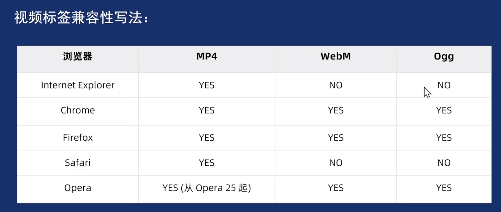
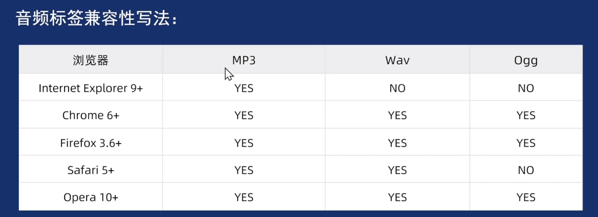
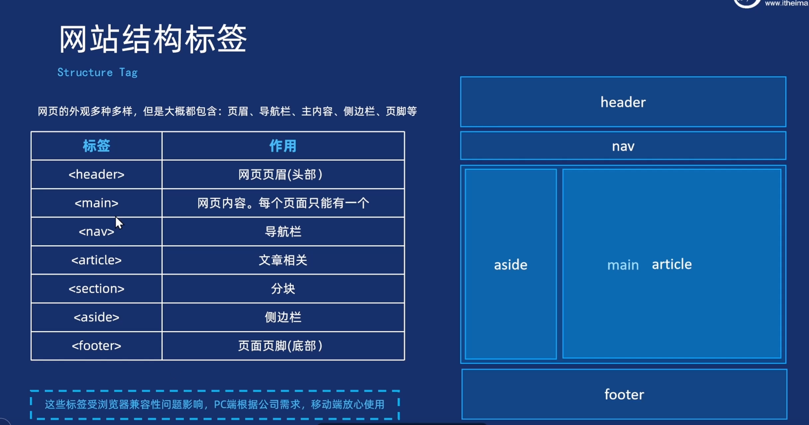

```html
<!DOCTYPE html>
```
文档类型声明，作用就是告诉浏览器使用哪种html版本来显示网页

```html
<html lang="en">
```
定义文档显示语言
（翻译成什么xxx）

```html
<meta charset="utf-8" />
```
字符集
## 标签

标题标签：h1-h6
段落：p
换行：br
水平线： hr

格式化标签：
加粗：strong/b
倾斜：em/i
删除线：del/s
下划线：ins/u

盒子标签：
div：独占一行
span：行内标签

```html

```
图像标签：
- width height 一般设置一个，另一个等比例缩放即可

标签的属性是键值对的形式：键=“值”

路径：
- 同级路径直接写
- 当前目录：./
- 下级路径：目录/目标文件
- 上级路径：../目录/目录文件

常见的图片格式：
- 网页优化：webp/avif，备选jpeg/png
- 透明图像：png静态/webp动态
- 动画：webp/gif
- 其他格式：svg/heic

视频标签：video
```html
<video src=""> </>
<video controls>
        <source src="https://www.w3schools.com/html/mov_bbb.mp4" type="video/mp4">
        <source src="https://www.w3schools.com/html/mov_bbb.mp4" type="video/ogg">
        <source src="https://www.w3schools.com/html/mov_bbb.mp4" type="video/webm">
    </video>
```
实际开发中基本只用mp4格式即可
相关属性：
- controls = “controls” 属性显示浏览器自带的控制按钮
h5中如果属性和值相等，可以直接简写controls即可
- autoplay  自动播放   想要autoplay，需要先muted
- loop   循环播放
- muted  静音
- poster  预览图像



音频标签：


```html
<audio autoplay>
        <source src="https://www.w3schools.com/html/horse.mp3" type="audio/mp3">
        <source src="https://www.w3schools.com/html/horse.mp3" type="audio/mpeg">
    </audio>
```

超链接标签：
```html
<a href="目标" target="以什么方式打开"> 链接显示的文字 </a>
<a href="#"> 空连接 </a>
<!--下载链接，对应一个文件或者一个压缩包-->
<!--各种网页元素：图片、表格、音频都可以加超链接，把他们当成一个文本看待就可以-->
<!--锚点链接-->
<a href="#目标的Id名称">锚点快速跳转</a>
```
```CSS
/* 让页面实现滑动效果  */
	html {
		scroll-behavior: smooth;
	}
```

target： 
- \_self  当前页面
- \_blank 新的页面

网页结构标签：


列表标签：用来布局的
- 无序列表：
	ul  li  
	ul中只可以放li，li里可以放任何标签
- 有序列表：
	ol li  
- 自定义列表：
	dl   列表块
	dt   定义列表名
	dd   列表项

表格标签： 
table 
thead 内部必须有tr标签
tbody 表格结构标签
th表格单元格 
tr td 用来展示数据

rowspan  跨行合并
colspan   跨列合并

表格属性：
 align  left、center、right
 border 边框
 cellpadding  文字和单元格边框的距离
 cellspacing   单元格之间的空白
 width
 height

表单标签：
form
	action url地址  提交到哪里
	 method 提交方式
	 name  表单名称
input表单元素
	type：button、checkbox、file、hidden、image、password
	radio、submit、text
属性：name   value  checked   maxlength

label标签
	for 绑定一个表单元素

select下拉标签
	option元素标签

textarea标签

注释标签

特殊字符：
&nbsp; 空格
&lt; 小于
&gt; 大于


