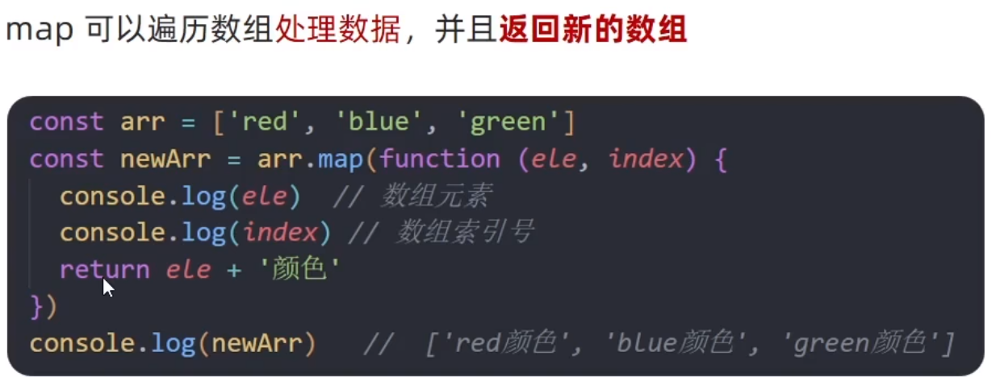
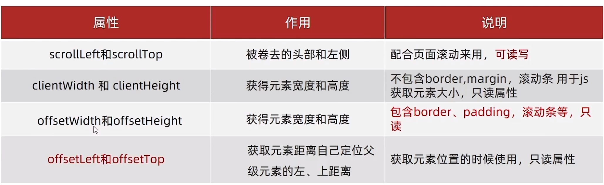

javascript

### 数据类型
- 基本数据类型
	- 数字类型  Number  整数，小数
	- 字符串类型  String  模板写法
	- 对象  Object

```javascript
let a = 10;
    console.log(`a 的值为: ${a}`);
```

	 - Boolean类型
	 - undefined类型 只有一个值 声明一个变量，未赋值  未被定义
	 - null  空类型   属于object

undefined未被赋值，null赋值了，但是内容为空

经常使用console.log()来打印信息
使用console.dir()来打印对象

#### 隐式转换
\+ 号两侧有一个是字符串类型的，会直接转换成字符串型进行拼接
其他的算数运算符，有一个是数字型的会尝试将两一个也转换成数字型进行运算
#### 显式转换
- 转数字
	- Number()
	- parseInt()  只保留整数
	- parseFloat  可保留小数
	- ‘’，null，undefined都会转成0
	- null == undefined 是true  但是  null === undefined是false
	- ‘’ - 2 = -2    null + 3 = 3   undefined + 2 = NaN
- 转bool
	- ‘’，0，undefined，null，false，NaN会识别为false，其余为true

=== 全等运算符号  判断值和类型是否完全一致

#### 数组
- 新增  arr.push('')  增加到末尾
- 新增  arr.unshift('')  增加到开头
- 删除  arr.pop()  删除末尾
- 删除  arr.shift()  删除开头
- 删除  arr.splice(起始位置，删除几个)  如果第二个参数不写后面的就全删了
- 排序  arr.sort()  升序
- 排序  arr.sort(function (a, b) { return b - a })  降序
- 转换  arr.join(拼接的分隔符)  使用分隔符拼接数组，默认用逗号分隔
- 迭代数组  arr.map，返回新的数组（对数组一通操作，拿到新数组）
	- 与forEach的区别就在于是否有返回值



```javascript
function bubbleSort(arr) {
    // 复制原数组，避免修改原始数据（可选，根据需求决定）
    const sortedArr = [...arr];
    const len = sortedArr.length;
    
    // 外层循环控制比较轮数
    for (let i = 0; i < len - 1; i++) {
        // 内层循环进行相邻元素比较与交换
        // 每轮结束后，最大的元素会“冒泡”到末尾，因此内层循环范围可以逐步缩小
        for (let j = 0; j < len - 1 - i; j++) {
            if (sortedArr[j] > sortedArr[j + 1]) {
                // 交换元素
                [sortedArr[j], sortedArr[j + 1]] = [sortedArr[j + 1], sortedArr[j]];
            }
        }
    }
    return sortedArr;
}

// 示例使用
const unsortedArray = [5, 2, 9, 1, 5, 6];
const sortedArray = bubbleSort(unsortedArray);
console.log("原始数组:", unsortedArray);  // 输出: [5, 2, 9, 1, 5, 6]
console.log("排序后数组:", sortedArray);  // 输出: [1, 2, 5, 5, 6, 9]
```


#### 函数
具名函数的调用可以写到任何位置，调用函数在定义之前定义之后都可以
匿名函数，函数表达式，不可以在定义之前调用

#### 逻辑运算符
&&  ||  ！
逻辑运算符的逻辑中断问题：
`||` 和 `&&` 在赋值和条件判断中的**计算规则完全相同**（返回其中一个操作数的原始值），只是 `if` 会额外把这个值转成 Boolean 来决定分支走向

### 对象
- 查询
	- obj.属性名
	- obj\['属性名'\]
- 遍历对象
	- ```javascript
	  const obj = { a: 1, b: 2, c: 3 };
		for (let key in obj) {
		    console.log(key, obj[key]);
		}
		// a 1, b 2, c 3		
		// 通常配合 hasOwnProperty 过滤原型属性
		for (let key in obj) {
		    if (obj.hasOwnProperty(key)) {
		        console.log(key, obj[key]);
		    }
		}
	  ```

- 常见的内置对象
	- Math
		- random：生成0-1之间的随机数
		- ceil：向上取整
		- floor：向下取整
		- max：找最大
		- min：找最小
		- pow：幂运算
		- abs：绝对值

### 变量
变量声明的三个关键字
- var  不用了
- let   变量会发生变化的时候使用
	- 简单类型的变化不能使用const
	- 简单类型放在栈上
- const  优先推荐使用
	- 复杂类型栈放地址，堆放内容
	- 地址不变，可以用const
	- 给对象添加修改属性没有问题，但是直接换一个对象时不行

### DOM  文档对象模型
- DOM用来操作标签的
- DOM对象
	- 浏览器根据html标签生成的js对象
	- 可以获取和修改对象的属性
	- document对象最大
		- document.write()
		- document.querySelector('css选择器')    选择第一个匹配的元素，只取一个
		- document.querySelectorAll('css选择器')   选择所有的元素，返回一个伪数组
			- 没有pop、push等数组方法
	-  .innerText   修改盒子内容，不识别标签
	-  .innerHtml   解析标签（推荐使用）
	-  .style.xxx修改样式
	-  .className  修改类名
	-  .classList  操作类名
		- add   添加
		- remove  移除
		- toggle   有就删掉没有就加
	-  表单.value  获取表单里的值
	-  按钮使用  .innerHTML获取按钮上的值
	-  表单.type  设置表单类型

#### 自定义属性
- data-自定义属性  
- 对象.dataset  会获取全部的自定义属性  对象.dataset.自定义属性，可获取自定义属性

#### 定时器

- setInterval(function, 间隔时间)
- 每个定时器都会返回一个id数字  方便对应开关
- ```javascript
let timer = null;
let count = 0;

// 开始定时器
function startTimer() {
    if (timer) 
	    return; // 防止重复开启
    
    timer = setInterval(() => {
        count++;
        console.log(`计时: ${count}秒`);        
    }, 1000);
}

// 停止定时器
function stopTimer() {
    if (timer) {
        clearInterval(timer);
        timer = null;
        console.log('定时器已停止');
    }
}

// 重置定时器
function resetTimer() {
    stopTimer();   
}
  ```

### 事件监听
- 元素对象.addEventListener('事件类型', 要执行的函数function)
- 在事件中设置const 在事件完成后可以被自动回收，所以再次点击的时候相当于重新触发，不会是重新赋值，所以不会报错
- 以前的写法是   事件源.on事件 = function xxx，
	- 区别就是on方式会被覆盖，addEventListener方式可以绑定多次

### 事件流
捕获：Document -- Element html -- element body -- element div
从dom的根元素开始去执行对应的事件
document.addEventListener('类型'，function(){}，是否捕获)
设置为true则是捕获，从大到小的执行，默认不写就是false，就是冒泡方式，从小到大
冒泡： element div -- element body -- Element html -- Document

#### 阻止冒泡
默认冒泡存在，会导致父级的触发，阻止冒泡需要拿到事件对象
事件对象.stopPropagation()
阻止事件流动传播，既可以阻止冒泡也可以阻止捕获

阻止默认行为：
事件对象. preventDefault()  链接跳转，按钮提交等

#### 解绑事件
removeEventListener，要有函数名才行

mouseover、mouseout会有冒泡
mouseenter、mouseleave与上一批的区别就是没有冒泡，推荐使用

JavaScript的事件注册方式
- 传统的on注册方式（L0）
	- 同一个对象，后注册的事件会覆盖前面注册的
	- 直接使用null覆盖就可以解绑
	- 都是冒泡阶段执行的
- addEventListener（L2）
	- 后面注册的不会覆盖前面的
	- 可以通过参数确定冒泡或者捕获
	- 使用removeEventListener进行解绑
	- 解绑需要有函数名

#### 事件委托
给父元素注册事件，当触发子元素的时候会冒泡到父元素身上，从而触发对应事件
原来需要给子元素挨个进行事件注册，现在只需要给父元素注册即可

然后可以通过e.target来进行对象目标元素的操作
比如我点了ul，但是我想知道是哪个li，就可以用e.target
e.target.tagName  标签名

###  BOM  浏览器对象模型

- 外部资源加载完毕事件 window  load：
	- 现在js会写到 </body> 之前，之前的写法会写到head标签内
	```javascript
    window.addEventListener('load', function () {
      const btn = document.querySelector('button')
      btn.addEventListener('click', function () {
        console.log('11');
      })
    })
	```

- 页面滚动事件 window  scroll
	- scrollTop 向上滚动的距离
	- document.documentElement.scrollTop
	- scrollTop可读写
- 页面尺寸事件 resize
	-  元素对象.clientWidth

#### 元素尺寸与位置
-  offsetWidth、offsetHeight 获取元素的宽高
- 获取的是可视的宽高，如果是隐藏的则是0
- offsetLeft、offsetTop  获取元素距离自己定位父级元素的左、上距离


#### 日期对象
- 实例化
	- new 关键字进行实例化
	- const date = new Date()
	- const date1 = new Date('2026-05-01')
- getFullYear()  获得年份   2026
- getMonth()  月份  0-11  操作时需要+1
- getDate()  获取日期具体某一天
- getDay()  星期几  0-6  数组下标
- getHours()  获取小时  0-23
- getMinutes()  获取分钟0-59
- getSeconds()   获取秒 0-59
- toLocaleString()   

#### 时间戳
是从1970年开始的一个 毫秒数
用来计算时间的方式
三种方法获取时间戳
- date.getTime()
-  + new Date()
- Date.now()

### 节点操作
- DOM节点
- parentNode节点
- childNodes  全部子节点，包括文本节点属性节点   
- children  只获取元素节点，返回伪数组

#### 创建节点
document.CreateElement
#### 追加节点
document.xxx.appendChild
数组追加
追加到后面

ul.insertBefore(新建元素，基准元素)
#### 克隆节点
元素.cloneNode(布尔值)
true：包含后代节点一起克隆
false：不包含后代节点   只有标签，值都没有
默认false

#### 删除节点
必须经过父元素删除元素
父元素.removeChild(子元素)

## Window对象
- ### BOM对象
- ### 延时函数
	- setTimeout
	- 执行一次
	- let timer = setTimeout(fn, 1000); clearTimeout(timer)
- ### location对象
	- location.hash  可以获取url中#后面的部分 
	- location.reload()  强制刷新
- ### navigator对象
	- navigator.userAgent
- ### history对象
	- history.go(-1)后退   history.go(1)前进
- ### 本地存储
	- sessionStorage
	- localStorage  本地存储里只能存字符串
		- localStorage.setItem('key', 'value')
		- localStorage.getItem('key')
		- localStorage.removeItem('key')
		- 对于复杂类型，需要先使用JSON.stringify(obj)将对象转换成字符串，然后再存储，再获取的话就可以使用了
		- 获取的时候使用JSON.parse()  将获取的字符串转换成对象
		- ```html
		  localStorage.setItem('obj', JSON.stringify(obj))
		  console.log(JSON.parse(localStorage.getItem('obj')))
		  ```

### 正则表达式
 #### 定义

const 变量名 = / 正则表达式的字面量 /

#### 元字符
- 边界符
	- ^ 以谁开头：^ A 以大A开头
	- $ 以谁结尾：Z$ 以Z结尾
- 量词
	- *   0次或多次
	- +  1次或多次
	- ?   0 || 1
	- {n}  重复n次
	- {n, }   重复n次或更多
	- {n, m}   重复n到m次
- 字符类
	- 【】 匹配字符集合   
	- 在【】 内加上 ^ 表示除了这些
	-  。表示除了换行符之外的任何单个字符
- 预定义
	- \d  数字0-9
	- \D  非数字
	- \w  [a-zA-Z0-9_]
	- \W  其他\w
	- \s  [\t\r\n\v\f]
	- \S  其他字符
- 修饰符
	- /表达式/修饰符
	- /i   不区分大小写
	- /g   全局查找，匹配所有结果


